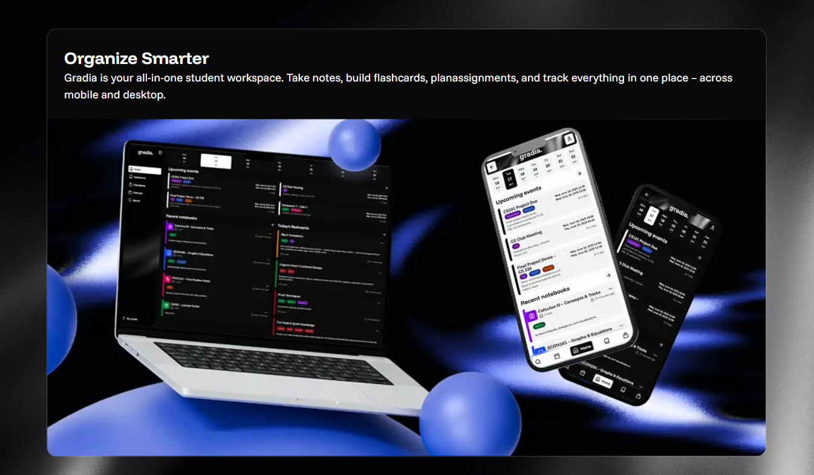
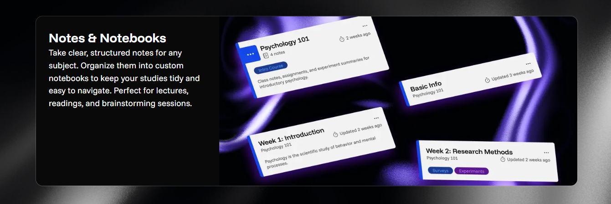
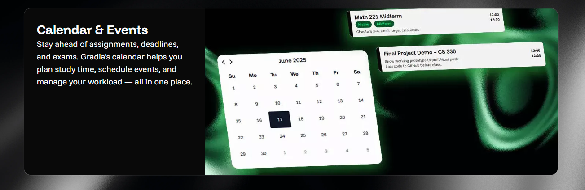
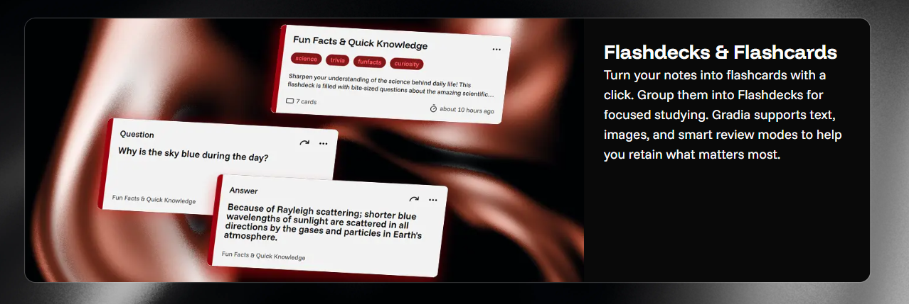

# Gradia

Gradia is a web application designed to help students manage their notes, study materials, and schedules in one place. It provides notebooks with a built-in Markdown editor, a calendar for events, and interactive flashcard sets called FlashDecks.

The goal of the project is to make studying and time management more organized, interactive, and efficient.

The app was developed in PB138 Course at FI MUNI.



---

## Features




Note: Currently, the app may not work properly in Firefox.

---

## Tech Stack

**Frontend:**
- React
- TypeScript
- Vite

**Backend:**
- Node.js
- Express
- Prisma
- PostgreSQL

**Infrastructure:**
- Docker

---

## Running the Project

### 1. Navigate to the backend directory

```
cd backend
```

### 2. Install dependencies

```
npm i
```

### 3. Copy the example environment file

```
cp .env.example .env
```

### 4. Start the backend

```
npm run start
```

### 6. Navigate to the frontend directory

```
cd ../frontend
```

### 7. Install dependencies

```
npm i
```

### 8. Start the frontend

```
npm run dev
```

Open http://localhost:5173 in your browser to access the app.

### Team Members:
Natália Ligačová, Jana Kmošková, Tomáš Bokor, Jozef Hoschek, Andrej Bugár

